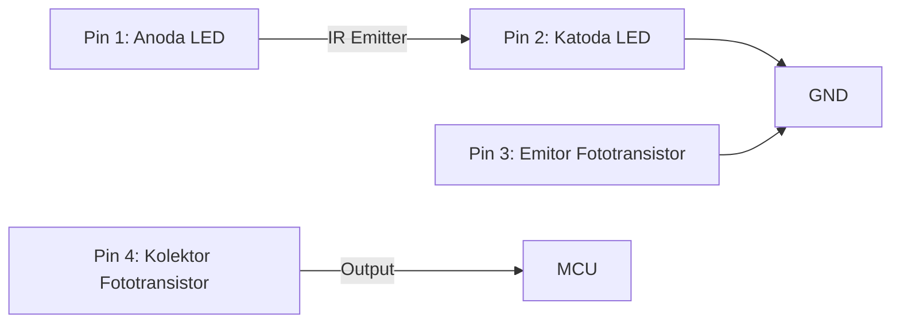
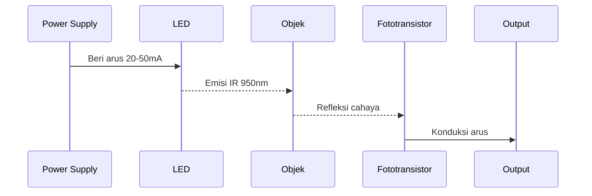
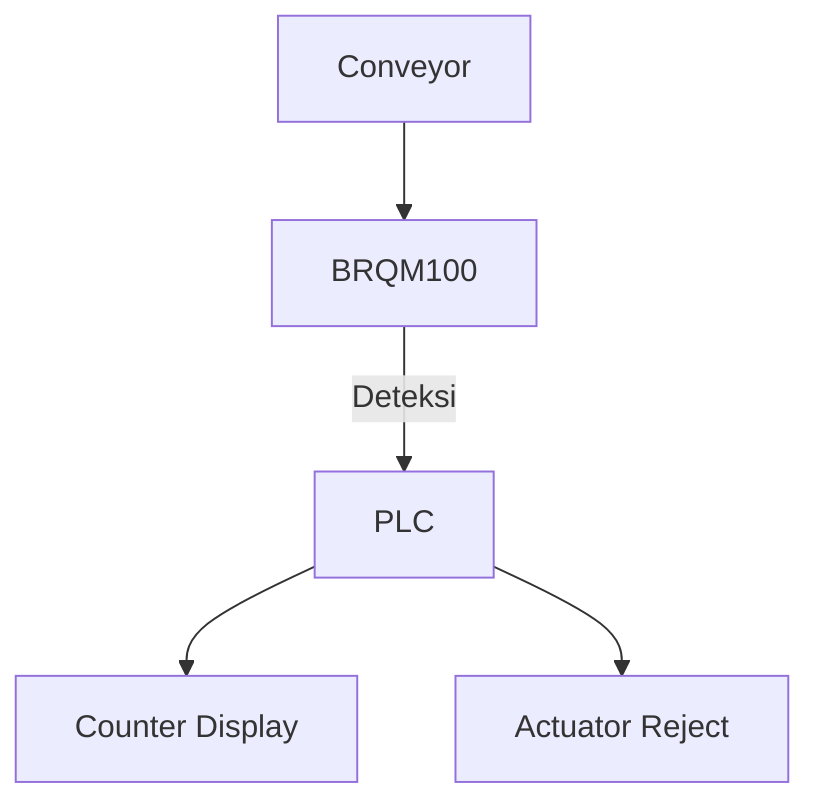

# **Dokumentasi Lengkap: Photo Sensor BRQM100-DDTA**

## **Daftar Isi**
1. **Pendahuluan**  
2. **Spesifikasi Teknis**  
3. **Diagram Pin dan Konfigurasi**  
4. **Prinsip Kerja Optoelektronik**  
5. **Karakteristik Spektral**  
6. **Rangkaian Aplikasi**  
7. **Panduan Interfacing dengan Mikrokontroler**  
8. **Kalibrasi dan Tuning**  
9. **Troubleshooting**  
10. **Aplikasi Industri**  
11. **Lembar Data Penting**  
12. **FAQ**  

---

## 1. Pendahuluan
**BRQM100-DDTA** adalah photo sensor tipe *reflective object sensor* yang menggabungkan **LED inframerah** dan **fototransistor** dalam satu paket kompak. Komponen ini dirancang untuk deteksi objek presisi pada jarak 0.1-10mm dengan respons cepat (<15μs), cocok untuk aplikasi:
- Sistem penghitung objek otomatis
- Deteksi posisi pada conveyor industri
- Sensor slot pada printer 3D
- Perangkat keamanan anti-jamming

---

## 2. Spesifikasi Teknis
| Parameter | Nilai | Unit |
|-----------|-------|------|
| Tegangan Operasi | 3.0 - 5.5 | V |
| Arus LED Maks | 50 | mA |
| Arus Fototransistor | 20 | mA |
| Jarak Deteksi | 0.1 - 10 | mm |
| Waktu Respon | 15 | μs |
| Panjang Gelombang LED | 950 | nm |
- **Paket**: Through-hole 4-pin
- **Isolasi Optik**: 0.8mm antara emitter dan detector
- **Suhu Operasi**: -25°C hingga +85°C

---

## 3. Diagram Pin dan Konfigurasi


### **Fungsi Pin:**
| Pin | Simbol | Fungsi |
|-----|--------|--------|
| 1 | A | Anoda LED Inframerah |
| 2 | K | Katoda LED |
| 3 | E | Emitor Fototransistor |
| 4 | C | Kolektor Fototransistor (Output) |

---

## 4. Prinsip Kerja Optoelektronik
### **Mekanisme Deteksi:**


### **Karakteristik Transfer:**
- **Tanpa Objek**: Fototransistor OFF → Output HIGH
- **Dengan Objek**: 
  ```
  I_c = η * P_opt * R
  ```
  Dimana:
  - η = Efisiensi detektor (0.8 typ)
  - P_opt = Daya optik terpantul
  - R = Responsivitas (0.5 A/W)

---

## 5. Karakteristik Spektral
### **Respon Spektral:**
| Komponen | Puncak | Rentang |
|----------|--------|---------|
| LED IR | 950nm | 850-1050nm |
| Fototransistor | 880nm | 700-1100nm |

### **Kurva Jarak vs Output:**
```mermaid
graph LR
    J[Jarak] --> O[Output]
    0mm -- Objek menempel --> Vout = 0.2V
    2mm -- Jarak optimal --> Vout = 2.5V
    10mm -- Batas deteksi --> Vout = 4.3V
    >10mm -- Tidak terdeteksi --> Vout = 5.0V
```

---

## 6. Rangkaian Aplikasi
### **Sirkuit Dasar:**
```mermaid
circuitDiagram
    VCC --> R1[220Ω] --> Pin1
    Pin2 --> GND
    Pin4 --> R2[10kΩ] --> VCC
    Pin4 -->|Sinyal| MCU
    Pin3 --> GND
```

### **Optimasi untuk Noise:**
- Tambahkan kapasitor 100nF antara VCC-GND
- Gunakan resistor pull-up 10kΩ pada output
- Shield kabel sinyal >10cm

---

## 7. Panduan Interfacing dengan Arduino
### **Koneksi Hardware:**
| BRQM100 | Arduino |
|---------|---------|
| Pin 1 | 5V via 220Ω |
| Pin 2 | GND |
| Pin 3 | GND |
| Pin 4 | D2 |

### **Sketch Deteksi Objek:**
```cpp
#define SENSOR_PIN 2

void setup() {
  Serial.begin(9600);
  pinMode(SENSOR_PIN, INPUT);
}

void loop() {
  int state = digitalRead(SENSOR_PIN);
  if (state == LOW) {
    Serial.println("Objek Terdeteksi!");
    delay(100); // Anti-bouncing
  }
}
```

### **Pembacaan Analog (Presisi):**
```cpp
// Gunakan resistor pull-up 10kΩ ke VCC
#define SENSOR_PIN A0

void setup() {
  Serial.begin(9600);
}

void loop() {
  int value = analogRead(SENSOR_PIN);
  float voltage = value * (5.0 / 1023.0);
  Serial.print("Voltage: ");
  Serial.println(voltage);
  delay(50);
}
```

---

## 8. Kalibrasi dan Tuning
### **Prosedur Kalibrasi Jarak:**
1. Pasang objek referensi pada jarak target
2. Ukur tegangan output
3. Atur potensiometer pada resistor LED:
   ```mermaid
   circuitDiagram
       VCC --> Pot[10kΩ] --> R[220Ω] --> LED
   ```
4. Set tegangan output = 50% Vcc saat objek ada

### **Tabel Setting Arus LED:**
| Kondisi | Arus LED | R_series |
|---------|----------|----------|
| Jarak Pendek (<2mm) | 20mA | 150Ω @5V |
| Jarak Menengah | 30mA | 100Ω @5V |
| Jarak Jauh (>8mm) | 50mA | 68Ω @5V |

---

## 9. Troubleshooting
| Masalah | Penyebab | Solusi |
|---------|----------|--------|
| Tidak mendeteksi | Arus LED terlalu kecil | Turunkan R_series |
| False triggering | Noise optik | Pasang tube mask 5mm |
| Output tidak stabil | Tegangan fluktuasi | Tambah kapasitor 100μF |
| Respon lambat | Kapasitansi parasit | Kurangi resistor pull-up |
| Deteksi lemah | Objek non-reflektif | Gunakan retroreflective tape |

---

## 10. Aplikasi Industri
### **Sistem Penghitung Botol:**


Parameter:
- Jarak: 5mm
- Kecepatan max: 100 objek/detik
- Resistor LED: 82Ω @24V (via regulator)

### **Endstop Printer 3D:**
```cpp
void homeZAxis() {
  while(digitalRead(Z_SENSOR) == HIGH) {
    stepper.step(-1);
    delayMicroseconds(200);
  }
  setHomePosition();
}
```

---

## 11. Lembar Data Penting
### **Absolute Maximum Ratings:**
| Parameter | Nilai |
|-----------|-------|
| Tegangan LED Reverse | 5V |
| Tegangan Kolektor-Emitter | 30V |
| Daya Disipasi | 100mW |
| Suhu Penyimpanan | -40°C to +100°C |

### **Karakteristik Fototransistor:**
| Parameter | Min | Typ | Max |
|-----------|-----|-----|-----|
| Arus Gelap (Vce=10V) | - | 100nA | 1μA |
| Gain Arus | 50 | 200 | - |
| Kapasitansi Junction | - | 20pF | - |

---

## 12. FAQ
**Q: Bisakah mendeteksi objek transparan?**  
A: Ya, dengan kalibrasi khusus. Gunakan latar belakang reflektif.

**Q: Apa pengaruh suhu terhadap performa?**  
A: Efisiensi turun 0.5%/°C. Untuk presisi tinggi, gunakan kompensasi suhu.

**Q: Bagaimana interfacing dengan PLC?**  
A: Gunakan modul input digital 24V dengan optocoupler.

**Q: Apa bedanya dengan TCRT5000?**  
A: BRQM100 memiliki respons 5x lebih cepat dan rentang jarak 2x lebih jauh.

**Q: Cara membersihkan lensa?**  
A: Gunakan alkohol isopropil 99% dan kuas halus.

---

**© Dokumentasi Teknis BRQM100-DDTA v1.3**  
*Referensi: Datasheet Broadcom BRQM100, Aplikasi Note #AN-003, Industrial Sensing Handbook*