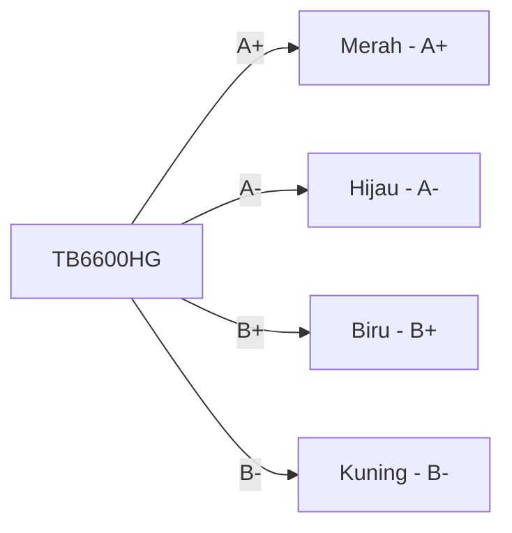
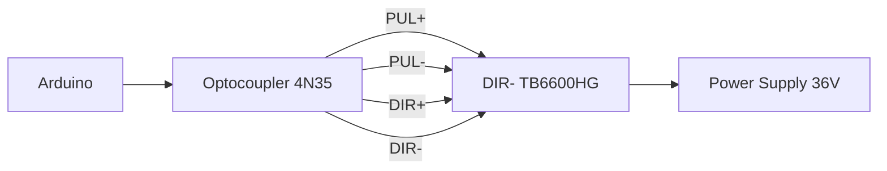
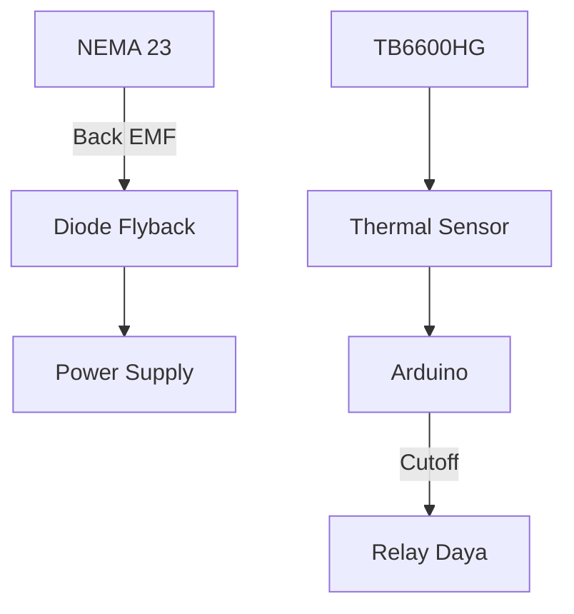

# **Dokumentasi Lengkap: Driver TB6600HG untuk Motor Stepper NEMA 23**

## **Daftar Isi**
1. **Pendahuluan**  
2. **Spesifikasi Motor NEMA 23**  
3. **Kompatibilitas dengan TB6600HG**  
4. **Diagram Pin dan Koneksi**  
5. **Prinsip Kerja dengan Beban Berat**  
6. **Konfigurasi Microstepping Optimasi Torsi**  
7. **Pengaturan Arus untuk NEMA 23**  
8. **Sistem Pendinginan dan Proteksi**  
9. **Panduan Pengkabelan Industri**  
10. **Contoh Implementasi CNC**  
11. **Kalkulasi Mekanis dan Elektrik**  
12. **Troubleshooting Khusus NEMA 23**  
13. **Aplikasi Berbeban Tinggi**  
14. **FAQ NEMA 23**  

---

## 1. Pendahuluan
**Motor NEMA 23** adalah motor stepper berukuran frame 57×57mm dengan torsi tinggi (0.5-3.0 Nm) untuk aplikasi industri. Dokumentasi ini menjelaskan integrasi optimal antara driver **TB6600HG** dengan motor NEMA 23, termasuk penyesuaian parameter untuk beban berat, pendinginan, dan stabilitas sistem.

---

## 2. Spesifikasi Motor NEMA 23
| Parameter | Nilai Tipikal | Catatan |
|-----------|---------------|---------|
| Ukuran Frame | 57×57mm (NEMA 23) | Standar industri |
| Torsi | 1.2-3.0 Nm | Tergantung model |
| Arus/Fase | 2.0-4.5A | Harus ≤ rating TB6600HG |
| Induktansi | 3-10 mH | Pengaruhi respons kecepatan |
| Tahanan/Fase | 0.8-2.5 Ω | |
| Sudut Step | 1.8° (200 step/rev) | Bipolar 2-fase |
| Berat | 0.8-1.5 kg | |

> ⚠️ **Peringatan**: Pilih model dengan arus ≤4.5A untuk kompatibilitas TB6600HG

---

## 3. Kompatibilitas dengan TB6600HG
### **Analisis Kesesuaian**
| Parameter | TB6600HG | NEMA 23 Tipikal | Status |
|-----------|----------|-----------------|--------|
| Arus Maks | 4.5A | 2.0-4.5A | ✔️ Compatible |
| Tegangan | 9-42V | Rekomendasi 24-48V | ✔️ Optimal |
| Microstepping | 1/32 | Mendukung presisi tinggi | ✔️ Ideal |
| Proteksi | Built-in | Penting untuk operasi terus-menerus | ✔️ Kritis |

### **Model NEMA 23 Rekomendasi**
1. **23HS30-3004S** (3.0A, 1.26 Nm)
2. **23HS45-4204S** (4.2A, 2.0 Nm)
3. **23HS22-2804S** (2.8A, 1.0 Nm)

---

## 4. Diagram Pin dan Koneksi
### **Wiring Motor NEMA 23 (4 Kabel)**


### **Identifikasi Kumparan**
1. Ukur resistansi antar kabel:
   - Pasangan 1: Merah-Hijau (Kumparan A)
   - Pasangan 2: Biru-Kuning (Kumparan B)
2. Pastikan resistansi sama (biasanya 0.8-2.5Ω)

### **Koneksi Logika (Isolasi Optik)**


---

## 5. Prinsip Kerja dengan Beban Berat
### **Karakteristik Dinamis NEMA 23**
- **Inersia Rotor Tinggi**: Membutuhkan torsi startup besar
- **Kurva Torsi-RPM**: 
  ```
  Torsi(ω) = T_max * e^(-kω)
  ```
  ω = kecepatan (RPM), k = konstanta motor

### **Strategi Penggerakan**
1. **Akselerasi Bertahap**:
   ```cpp
   void rampAccel() {
     for (int i=100; i<1000; i+=50) {
       setSpeed(i);  // steps/sec
       delay(20);
     }
   }
   ```
2. **Deceleration Zone**: Beri jarak 20% untuk pengereman

---

## 6. Konfigurasi Microstepping Optimasi Torsi
### **Trade-off Resolusi vs Torsi**
| Microstepping | Torsi Statis | Torsi Dinamis | Aplikasi NEMA 23 |
|---------------|--------------|---------------|------------------|
| 1/1 (Full) | 100% | 100% | Press Machine |
| 1/8 | 85% | 95% | CNC Router |
| 1/16 | 70% | 85% | Conveyor |
| 1/32 | 50% | 65% | 3D Printer Industri |

### **Setting DIP Switch**
| Resolusi | SW1 | SW2 | SW3 |
|----------|-----|-----|-----|
| 1/8 | ON | OFF | ON |
| 1/16 | ON | ON | OFF |
| 1/32 | OFF | ON | OFF |

---

## 7. Pengaturan Arus untuk NEMA 23
### **Formula Kalibrasi Torsi**
```
V_ref = (I_motor * R_sense) / 0.8
```
- `R_sense = 0.5Ω` (internal TB6600HG)
- Contoh motor 3.5A: 
  ```
  V_ref = (3.5 * 0.5) / 0.8 = 2.1875V
  ```

### **Prosedur Pengukuran**
1. Putar potensiometer searah jarum jam untuk naikkan arus
2. Ukur antara **Vref** dan **GND**
3. Setel ke nilai sesuai tabel:

| Arus (A) | Vref (V) | Torsi Relatif |
|----------|----------|---------------|
| 2.0 | 1.25 | 60% |
| 3.0 | 1.87 | 85% |
| 4.0 | 2.50 | 100% |
| 4.5 | 2.81 | 105%* |

> *Hanya untuk duty cycle intermiten

---

## 8. Sistem Pendinginan dan Proteksi
### **Desain Heatsink**
| Parameter | Rekomendasi |
|-----------|-------------|
| Material | Aluminium 6063 |
| Ukuran | 50×50×20 mm |
| Thermal Paste | Arctic MX-4 |
| Suhu Operasi Aman | <75°C |

### **Skema Proteksi Tambahan**


---

## 9. Panduan Pengkabelan Industri
### **Kabel Berampiran (Shielded)**
| Sinyal | Kabel | Grounding |
|--------|-------|-----------|
| PUL/DIR | Twisted Pair | Drain wire ke chassis |
| Motor | 18 AWG | Shield aluminium |
| Daya | 16 AWG | Ferrite bead |

### **Layout Anti-Noise**
1. Pisahkan kabel daya dan sinyal
2. Jarak minimal 15cm antara bundle
3. Gunakan cable gland metal untuk entry panel

---

## 10. Contoh Implementasi CNC
### **G-code Interpreter dengan Microstepping**
```cpp
#define MICROSTEPS 8  // 1/8 microstepping

void moveTo(float mm) {
  long steps = mm * STEPS_PER_MM * MICROSTEPS;
  stepper.moveTo(steps);
}

void setup() {
  // NEMA 23: 200 step/rev, 5mm/rev lead screw
  const float STEPS_PER_MM = 200.0 / 5.0; 
  stepper.setMaxSpeed(2000);  // steps/sec
  stepper.setAcceleration(1000);
}
```

### **Parameter CNC**
| Parameter | Nilai | Rumus |
|-----------|-------|-------|
| Steps/mm | 80 | (200 step/rev × 8 microstep) / 5 mm/rev |
| Max Feedrate | 500 mm/mnt | MaxSpeed × 60 / Steps_per_mm |
| Cutting Speed | 3000 mm/mnt | Tergantung material |

---

## 11. Kalkulasi Mekanis dan Elektrik
### **Seleksi Power Supply**
```
P_supply = 1.2 * √2 * V_motor * I_motor
```
Contoh untuk 2 motor NEMA 23 (3.5A, 36V):
```
P_supply = 1.2 * 1.414 * 36 * 3.5 * 2 = 426W → Pilih 500W
```

### **Perhitungan Torsi vs Inersia**
```
T_accel = J_total * α
J_total = J_motor + J_load
α = (2π * RPM) / (60 * t_accel)
```

---

## 12. Troubleshooting Khusus NEMA 23
| Gejala | Diagnosa | Solusi |
|--------|----------|--------|
| Getaran hebat | Resonansi mekanik | Pasang damper mekanis |
| Kehilangan step saat beban | Arus terlalu rendah | Naikkan Vref (+10%) |
| Suara berisik | Frekuensi PWM tidak optimal | Tambah kapasitor 100μF di VCC-GND |
| Motor sangat panas | Arus terlalu tinggi | Turunkan Vref, cek pendingin |
| Gerakan tersendat | Tegangan supply turun | Gunakan PSU kapasitas lebih besar |

---

## 13. Aplikasi Berbeban Tinggi
### **Conveyor Industri**


Parameter:
- Microstepping: 1/4
- Arus: 4.0A
- Tegangan: 36V
- Reduksi: 3:1 (tingkatkan torsi 300%)

### **Press Hidrolik**
- Torsi puncak: 2.8 Nm
- Mode operasi: Full step
- Siklus kerja: 30 detik ON / 90 detik OFF

---

## 14. FAQ NEMA 23
**Q: Bisakah TB6600HG drive NEMA 23 6A?**  
A: Tidak! Gunakan driver khusus seperti DM860T untuk arus >4.5A.

**Q: Mengapa perlu optocoupler?**  
A: Isolasi noise elektrik dari sistem daya tinggi dan proteksi microcontroller.

**Q: Berapa RPM maksimal NEMA 23?**  
A: Tergantung model, biasanya 800-1500 RPM dengan tegangan cukup.

**Q: Bagaimana mengatasi kehilangan torsi di RPM tinggi?**  
A: Tingkatkan tegangan supply (hukum V = L di/dt).

**Q: Apa beda NEMA 23 dan 34?**  
A: NEMA 34 lebih besar (86mm frame) dengan torsi 3-8 Nm, butuh driver lebih powerful.

---

**© Dokumentasi Teknis TB6600HG + NEMA 23 v2.1**  
*Berdasarkan: TB6600HG Datasheet, NEMA 23 Technical Specs, Industrial Automation Guidelines*