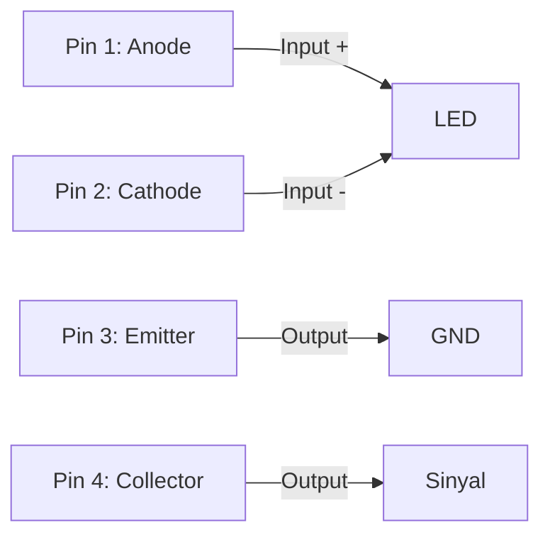
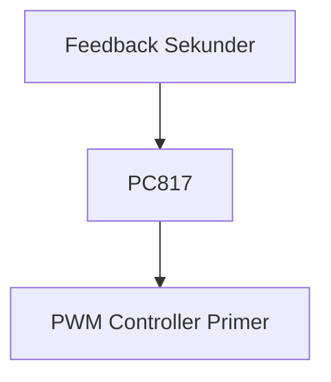

# **Dokumentasi Lengkap: Optocoupler PC817**

## **Daftar Isi**
1. **Pendahuluan**  
2. **Spesifikasi Teknis**  
3. **Diagram Pin dan Konfigurasi**  
4. **Prinsip Kerja Optoisolasi**  
5. **Karakteristik Transfer Sinyal**  
6. **Rangkaian Dasar dan Desain**  
7. **Interfacing dengan Mikrokontroler**  
8. **Aplikasi Industri**  
9. **Pengujian dan Kalibrasi**  
10. **Troubleshooting**  
11. **Model Ekuivalen**  
12. **FAQ**  

---

## 1. Pendahuluan
**PC817** adalah optocoupler berbasis **infrared diode dan fototransistor** yang menyediakan isolasi elektrik hingga **5.000V RMS** antara input dan output. Komponen ini digunakan untuk:  
- Mengisolasi rangkaian tegangan tinggi dan rendah  
- Mencegah noise elektrik dan ground loop  
- Mentransmisikan sinyal digital/analog antar sistem yang berbeda potensial .  
Dengan respons waktu **18μs** dan arus kolektor hingga **50mA**, PC817 cocok untuk aplikasi kontrol industri, power supply, dan sistem mikrokontroler .

---

## 2. Spesifikasi Teknis
### **Parameter Kritis:**
| **Parameter** | **Nilai** | **Unit** | 
|---------------|-----------|----------|
| Tegangan Isolasi | 5.000 | V RMS | 
| Tegangan Forward LED (Vf) | 1.25 (Typ) | V | 
| Arus Forward Maks (If) | 50 | mA | 
| Tegangan Kolektor-Emitter (VCEO) | 80 | V | 
| Arus Kolektor Maks (Ic) | 50 | mA | 
| Waktu Naik/Turun (tr/tf) | 18 | μs | 
| Frekuensi Cut-off | 80 | kHz | 
| Rentang Suhu | -30 hingga +100 | °C | 
| Disipasi Daya | 200 | mW | 

### **Paket Komponen:**
- **DIP-4** (Through-hole) 
- **SOP-4** (Surface Mount) 

---

## 3. Diagram Pin dan Konfigurasi
### **Pinout:**


### **Fungsi Pin:**
| **Pin** | **Nama** | **Fungsi** | 
|---------|----------|------------|
| 1 | Anode | Terminal positif IR LED (input) | 
| 2 | Cathode | Terminal negatif IR LED (ground input) | 
| 3 | Emitter | Ground output fototransistor | 
| 4 | Collector | Output sinyal fototransistor | 

> ⚠️ **Catatan**: Pin 3 dan 4 **tidak boleh terhubung** ke ground input untuk menjaga isolasi!

---

## 4. Prinsip Kerja Optoisolasi
PC817 bekerja melalui konversi **sinyal listrik → cahaya → sinyal listrik**:  
1. **Input**: Tegangan pada anode (Pin 1) mengaktifkan IR LED memancarkan cahaya inframerah (λ = 950nm).  
2. **Isolasi**: Cahaya melewati celah udara internal (isolasi galvani).  
3. **Output**: Fototransistor mendeteksi cahaya, mengalirkan arus antara kolektor-emitter.  
4. **Konversi**: Perubahan arus output mereproduksi sinyal input tanpa koneksi listrik .  

**Isolasi Efektif**:  
- Mencegah transient voltage hingga 5kV  
- Menghilangkan ground loop  
- Memproteksi mikrokontroler dari noise tegangan tinggi .

---

## 5. Karakteristik Transfer Sinyal
### **Current Transfer Ratio (CTR):**
- Rasio arus output (Ic) terhadap arus input (If)  
- Rumus: **CTR (%) = (Ic / If) × 100**  
- Nilai tipikal: 50-600% tergantung grade (PC817A-D) 

### **Respon Frekuensi:**
```mermaid
graph LR
  F[Frekuensi] --> G[Gain]
  0 -- DC hingga 10kHz --> Gain_Max
  80kHz --> Gain_-3dB
  >100kHz --> Gain_0
```

### **Waktu Respons:**
- Rise time (tr): 18μs  
- Fall time (tf): 18μs  
- Batasan kecepatan: Cocok untuk aplikasi < 80kHz .

---

## 6. Rangkaian Dasar dan Desain
### **Rangkaian Minimal:**
```mermaid
circuitDiagram
  VCC --> R1[330Ω] --> Pin1
  Pin2 --> GND1
  VCC2 --> R2[10kΩ] --> Pin4
  Pin4 --> OUT
  Pin3 --> GND2
```

### **Perhitungan Resistor Input (R1):**
- **Rumus**: R1 = (V_in - Vf) / If  
- Contoh: V_in = 5V, If = 10mA → R1 = (5 - 1.25)/0.01 = 375Ω (gunakan 330Ω)  

### **Desain Output:**
- Mode **Switch**:  
  ```mermaid
  circuitDiagram
    Pin4 --> LOAD[Relay] --> VCC
    Pin3 --> GND
  ```
- Mode **Analog**:  
  Tambahkan resistor pull-up 1-10kΩ di Pin 4 .

---

## 7. Interfacing dengan Mikrokontroler
### **Koneksi Arduino:**
| **PC817** | **Arduino** | 
|-----------|-------------|
| Pin 1 | D2 via 330Ω | 
| Pin 2 | GND | 
| Pin 4 | A0 (untuk analog) / D3 (untuk digital) | 
| Pin 3 | GND terpisah |  

### **Kode Pembacaan Digital:**
```cpp
#define OPT_PIN 3

void setup() {
  Serial.begin(9600);
  pinMode(OPT_PIN, INPUT);
}

void loop() {
  int state = digitalRead(OPT_PIN);
  Serial.println(state ? "Terisolasi: HIGH" : "Aktif: LOW");
  delay(100);
}
```

### **Kode Pembacaan Analog (CTR Measurement):**
```cpp
void loop() {
  analogReadResolution(12);
  int adc = analogRead(A0);
  float voltage = adc * (3.3 / 4095.0);
  float Ic = voltage / 1000.0;  // Jika R_load = 1kΩ
  Serial.print("Arus Kolektor: "); Serial.print(Ic, 3); Serial.println(" mA");
}
``` 

---

## 8. Aplikasi Industri
### **Power Supply Terisolasi:**

- Isolasi sinyal feedback di SMPS 

### **Zero-Cross Detection (AC Control):**
- Deteksi perpotongan nol gelombang AC  
- Rangkaian:  
  ```mermaid
  circuitDiagram
    AC --> R[100kΩ] --> Bridge[Bridge Rectifier] --> PC817_Pin1
    PC817_Pin4 --> Arduino_Interrupt
  ```
- Implementasi dimmer AC dengan TRIAC 

### **Motor Control:**
- Isolasi sinyal PWM dari mikrokontroler ke driver motor  
- Proteksi terhadap back EMF 

---

## 9. Pengujian dan Kalibrasi
### **Prosedur Pengujian:**
1. Ukur resistansi LED: Multimeter di mode diode, anode(+) ke cathode(-) ≈ 1.25V  
2. Uji fototransistor:  
   - Beri daya 5V ke Pin 1 via 330Ω  
   - Ukur Vce: < 0.4V (aktif), > 4.9V (non-aktif)  

### **Rangkaian Tes CTR:**
```mermaid
circuitDiagram
  VCC --> R1[330Ω] --> Pin1
  Pin2 --> GND
  VCC --> mA_Meter --> Pin4
  Pin3 --> GND
  Pin4 --> Voltmeter
```
- Hitung CTR = (Ic / If) × 100 

---

## 10. Troubleshooting
| **Masalah** | **Penyebab** | **Solusi** | 
|-------------|--------------|------------|
| Output selalu HIGH | LED rusak | Ganti komponen | 
| Output selalu LOW | Kebocoran fototransistor | Ganti komponen | 
| Respon lambat | Arus If terlalu rendah | Turunkan nilai R1 | 
| Sinyal noisy | Tidak ada decoupling | Tambah kapasitor 100nF di VCC | 
| CTR menurun | Degradasi LED | Tingkatkan If atau ganti komponen | 

---

## 11. Model Ekuivalen
### **Alternatif Langsung:**
- **PC817A, B, C, D** (Grade berbeda CTR)  
- **EL817** (Spesifikasi mirip)  

### **Substitusi Fungsional:**
| **Model** | **Keunggulan** | **Aplikasi** | 
|-----------|----------------|--------------|
| 4N25 | Tahan tegangan tinggi | Industri berat | 
| 6N137 | Kecepatan tinggi (1MHz) | Komunikasi data | 
| MOC3021 | Kontrol AC langsung | Dimmer lampu | 
| TLP621 | Isolasi tinggi | Medis | 

---

## 12. FAQ
**Q: Apa perbedaan PC817 dan EL817?**  
A: Secara fungsional identik, bedanya hanya pada pabrikan (Sharp vs Everlight) .  

**Q: Bisakah PC817 menghandle sinyal analog?**  
A: Ya, dengan linearisasi CTR, tetapi akurasi terbatas. Untuk presisi tinggi, gunakan optocoupler tipe linear seperti IL300 .  

**Q: Mengapa output saya tidak stabil?**  
A: Pastikan:  
- Ground input/output terpisah  
- Tidak ada noise elektromagnetik dekat komponen  
- Arus If > 5mA .  

**Q: Berapa umur pakai PC817?**  
A: > 100.000 jam jika If < 30mA dan suhu < 85°C .  

**Q: Dapatkah PC817 mengisolasi RS485?**  
A: Tidak direkomendasikan untuk kecepatan > 19.2kbps. Gunakan 6N137 untuk aplikasi baud rate tinggi .  

---

**© Dokumentasi Teknis PC817 v2.3**  
*Referensi: Datasheet Sharp PC817, Aplikasi Note #AN-015, Industrial Isolation Handbook*