# PalletizerV1.3 Alur Komunikasi Sistem (Bahasa Indonesia)

## Diagram Alur Data Sistem Lengkap - Flowchart Tunggal

```mermaid
graph TD
    Start[Sistem Menyala] --> Central[Inisialisasi Central State Machine]
    Central --> EEPROM[Memuat Parameter EEPROM]
    EEPROM --> DIP[Membaca DIP Switch Layer Awal ARM1/ARM2]
    DIP --> CentralReady[Central SIAP - Main Loop Dimulai]
    
    ArmStart[Inisialisasi ARM Control] --> DeviceID[Deteksi ARM1 atau ARM2 via pin A4-A5]
    DeviceID --> ArmSerial[Inisialisasi RS485 dan AltSoftSerial]
    ArmSerial --> ArmZero[Masuk State ZEROING - Sekuens PARK]
    ArmZero --> ArmSleep[State SLEEPING - Tunggu Tombol START]
    
    DriverStart[Inisialisasi Driver] --> StrapID[Baca Strap Pin D3D4D5 untuk ID X,Y,Z,T,G]
    StrapID --> SpeedSet[Set Parameter Kecepatan Koneksi A1-A2]
    SpeedSet --> DriverReady[Driver SIAP - Dengar AltSoftSerial]
    
    CentralReady --> SensorRead[Baca Sensor S1,S2,S3 dan Status ARM]
    SensorRead --> StateUpdate[Update State Machine ARM1 dan ARM2]
    StateUpdate --> Logic{Cek Logika Sistem}
    
    Logic -->|Sensor3 HIGH + ARM Tersedia| HomeGen[Generate Perintah HOME]
    HomeGen --> HomePrefix[Tambah Prefix L# atau R#]
    HomePrefix --> HomeCRC[Hitung XOR Checksum]
    HomeCRC --> RS485Send[Kirim via RS485: L#H3870,390,3840,240,-30*7F]
    
    RS485Send --> ArmReceive[ARM Control Terima RS485]
    ArmReceive --> ArmCRC[Validasi CRC Checksum]
    ArmCRC --> ArmFilter{Cek Kecocokan Prefix L atau R}
    ArmFilter -->|Cocok| ArmParse[Parse Parameter Perintah HOME]
    ArmFilter -->|Tidak Cocok| ArmIgnore[Abaikan Perintah]
    
    ArmParse --> HomeSeq[Mulai Sekuens HOME 2 Langkah]
    HomeSeq --> MotorCmd1[Buat Langkah 1: X3870,Y390,T240,G-30]
    MotorCmd1 --> MotorCRC1[Tambah Checksum: X3870,Y390,T240,G-30*A3]
    MotorCRC1 --> AltSend1[Kirim via AltSoftSerial]
    
    AltSend1 --> DriverRx[Driver Terima Perintah]
    DriverRx --> DriverCRCCheck[Validasi CRC]
    DriverCRCCheck --> MultiParse[Parse Multi-Perintah dengan Koma]
    MultiParse --> FilterID{Cek Kecocokan ID Driver}
    
    FilterID -->|Driver X| XMotor[Sumbu-X Gerak ke 3870]
    FilterID -->|Driver Y| YMotor[Sumbu-Y Gerak ke 390]
    FilterID -->|Driver T| TMotor[Sumbu-T Gerak ke 240]
    FilterID -->|Driver G| GMotor[Sumbu-G Gerak ke -30]
    FilterID -->|Driver Z| ZIgnore[Abaikan - Bukan di Langkah 1]
    
    XMotor --> XReady[X Selesai - LED NYALA]
    YMotor --> YReady[Y Selesai - LED NYALA]
    TMotor --> TReady[T Selesai - LED NYALA]  
    GMotor --> GReady[G Selesai - LED NYALA]
    
    XReady --> AllReady{Semua Motor Siap?}
    YReady --> AllReady
    TReady --> AllReady
    GReady --> AllReady
    
    AllReady -->|Ya| MotorCmd2[Buat Langkah 2: Z3840]
    MotorCmd2 --> AltSend2[Kirim Z3840*B1]
    AltSend2 --> ZMotor[Sumbu-Z Gerak ke 3840]
    ZMotor --> ZReady[Z Selesai - HOME Selesai]
    
    ZReady --> ArmRunning[ARM Control State RUNNING]
    ArmRunning --> StatusPin[Set COMMAND_ACTIVE_PIN LOW]
    StatusPin --> CentralStatus[Central Baca Status ARM via Pin 7/8]
    CentralStatus --> ArmInCenter[Set arm_in_center = ARM_ID]
    
    ArmInCenter --> ProductCheck{Produk Terdeteksi?}
    ProductCheck -->|S1,S2,S3 Semua LOW| GladGen[Generate Perintah GLAD 8 Langkah]
    ProductCheck -->|Tidak Ada Produk| SensorRead
    
    GladGen --> GladSend[Kirim via RS485: L#G1620,2205,3975,240,60,270,750,3960,2340,240*B7]
    GladSend --> GladSeq[ARM Eksekusi Sekuens GLAD 8 Langkah]
    GladSeq --> ConveyorOff[Matikan Conveyor 3 detik]
    ConveyorOff --> ArmPicking[ARM State: PICKING]
    ArmPicking --> GladComplete[GLAD Selesai - Kembali ke READY]
    
    GladComplete --> SpecialCheck{Perlu Perintah Khusus?}
    SpecialCheck -->|Layer Genap Selesai| CaliCmd[Kirim Perintah CAL L#C*2D]
    SpecialCheck -->|Semua Layer Selesai| ParkCmd[Kirim Perintah PARK L#P*1F]
    SpecialCheck -->|Lanjut| NextPos[Increment Posisi]
    
    CaliCmd --> ArmCali[ARM Eksekusi Sekuens Kalibrasi]
    ParkCmd --> ArmPark[ARM Eksekusi Sekuens Park Z0,X0T0G0,Y0]
    ArmCali --> NextPos
    ArmPark --> Reset[Auto Reset ke Layer 0]
    Reset --> NextPos
    
    NextPos --> SensorRead
    ArmIgnore --> SensorRead
    ZIgnore --> AllReady
```

## Ringkasan Komunikasi Utama

**SIAPA YANG MEMULAI**: Central State Machine (Master)  
**PESAN PERTAMA**: `"L#H(3870,390,3840,240,-30)*7F"` saat sensor3 HIGH  
**JALUR KOMUNIKASI**: Central → ARM Control → Drivers  
**UMPAN BALIK STATUS**: Drivers → ARM Control → Central via pin hardware  
**SIKLUS UTAMA**: ~30ms pembacaan sensor → update state → generasi perintah → komunikasi → umpan balik status

## Penjelasan Detail Alur Sistem

### 🚀 **Urutan Startup Sistem:**

1. **PERTAMA**: Semua komponen menyala bersamaan
2. **KEDUA**: Central memuat parameter EEPROM → baca DIP switch → inisialisasi state machine
3. **KETIGA**: ARM Control deteksi device ID → inisialisasi serial → masuk state ZEROING
4. **KEEMPAT**: Drivers deteksi hardware ID → set kecepatan → inisialisasi stepper

### 📡 **Komunikasi Pertama:**

1. **PEMRAKARSA**: Central State Machine (Master)
2. **PESAN PERTAMA**: Perintah HOME saat sensor3 menjadi HIGH
3. **DATA**: `"L#H(3870,390,3840,240,-30)*7F"` via RS485
4. **PENERIMA**: ARM Control (filter berdasarkan prefix device L/R)
5. **RESPONS**: ARM Control memecah menjadi perintah motor
6. **AKHIR**: Drivers eksekusi gerakan motor individual

### ⚙️ **Proses Operasional Utama:**

#### **Fase 1: Deteksi dan Persiapan**
- Central membaca sensor (S1: deteksi produk 1, S2: deteksi produk 2, S3: ARM di tengah)
- Update state machine ARM1 dan ARM2
- Cek logika sistem untuk menentukan aksi selanjutnya

#### **Fase 2: Perintah HOME**
- Generate koordinat HOME berdasarkan parameter EEPROM
- Tambahkan prefix ARM (L# untuk ARM1, R# untuk ARM2)
- Hitung checksum XOR untuk validasi
- Kirim via RS485 ke ARM Control

#### **Fase 3: Eksekusi HOME (2 Langkah)**
- **Langkah 1**: Gerakkan X,Y,T,G secara bersamaan
- **Langkah 2**: Gerakkan Z ke posisi akhir
- Setiap driver filter perintah berdasarkan ID-nya (X,Y,Z,T,G)
- Status feedback via pin hardware

#### **Fase 4: Deteksi Produk**
- Tunggu semua sensor LOW (produk terdeteksi)
- Generate perintah GLAD (8 langkah kompleks)
- Matikan conveyor sementara (3 detik)

#### **Fase 5: Perintah GLAD (8 Langkah)**
1. **Langkah 1**: Z ke posisi aman (zb)
2. **Langkah 2**: Buka gripper (gp)
3. **Langkah 3**: Z turun untuk pendekatan (zn-za)
4. **Langkah 4**: X,Y,T ke posisi target
5. **Langkah 5**: Z ke posisi pickup final (zn)
6. **Langkah 6**: Tutup gripper (dp)
7. **Langkah 7**: Z naik angkat produk (zn-za)
8. **Langkah 8**: X,T ke posisi standby (xa,ta)

#### **Fase 6: Perintah Khusus**
- **Kalibrasi (CAL)**: Setelah layer genap selesai
- **Park (PARK)**: Setelah semua layer selesai
- **Auto-Reset**: Kembali ke layer 0 untuk siklus baru

### 🔧 **File Kritis dan Lokasi Kode:**

- **PalletizerCentralStateMachine.ino** (Baris 1328: Kirim RS485)
- **PalletizerArmControl.ino** (Baris 474: Terima RS485, Baris 595: Kirim AltSoft)
- **PalletizerArmDriver.ino** (Baris 251: Terima AltSoft, Baris 308: Filter ID)

### 🔍 **Pin Hardware Komunikasi:**

**Central State Machine:**
- Pin 7: Input dari ARM1 (status)
- Pin 8: Input dari ARM2 (status)
- Pin 10,11: RS485 komunikasi

**ARM Control:**
- Pin 13: Output status ke Central
- Pin 3: Input status dari Drivers
- Pin 8,9: AltSoftSerial ke Drivers
- Pin 10,11: RS485 dari Central

**Drivers:**
- Pin 13: Output status LED
- Pin 8,9: AltSoftSerial dari ARM Control
- Pin D3,D4,D5: Strap pins untuk ID
- Pin A1,A2: Pemilihan kecepatan

### ⚡ **Jalur Sukses Kritis:**

Pembacaan sensor Central → Logika state machine → Generasi perintah → Kirim RS485 → Terima ARM → Validasi CRC → Parse perintah → Generasi perintah motor → Kirim AltSoft → Terima Driver → Filter ID → Eksekusi motor → Umpan balik status → Update state → Siklus berikutnya

Flowchart ini menunjukkan dengan tepat siapa yang memulai, kapan, dan data apa yang dikirim pada setiap tahap sistem!