# PalletizerV1.3 System Communication Flowchart
*Detailed Mermaid Diagrams showing exact data flow and timing*

## 1. System Startup Flow

```mermaid
graph TD
    A[System Power ON] --> B[Central State Machine<br/>PalletizerCentralStateMachine.ino<br/>Line 1087: setup()]
    B --> C[Load EEPROM Parameters<br/>Line 1117: loadParametersFromEEPROM()]
    C --> D{EEPROM Valid?}
    D -->|No| E[Reset to Defaults<br/>Line 1118: resetParametersToDefault()]
    D -->|Yes| F[Parameters Loaded<br/>56 parameters total]
    E --> F
    F --> G[Read DIP Switches<br/>Line 1125: readDipSwitchLayers()]
    G --> H[ARM1 Start Layer: DIP pins D5,D6,D3,D4<br/>ARM2 Start Layer: DIP pins A0,A1,A3,A2]
    H --> I[Initialize RS485<br/>Line 1089: rs485.begin(9600)]
    I --> J[Initialize ARM State Machines<br/>Line 1128: initializeArmDataStateMachine()]
    J --> K[Central READY<br/>Print: System ready with generated commands]
    
    L[ARM Control Startup<br/>PalletizerArmControl.ino<br/>Line 186: setup()] --> M[Device Detection<br/>Line 193: isARM2()]
    M --> N{A4 == LOW?}
    N -->|Yes| O[Device: ARM2<br/>Prefix: R]
    N -->|No| P[Device: ARM1<br/>Prefix: L]
    O --> Q[Initialize Serial<br/>Line 198: initializeSerial()]
    P --> Q
    Q --> R[RS485: Line 259<br/>AltSoftSerial: Line 256]
    R --> S[Enter ZEROING State<br/>Line 206: enterZeroingState()]
    
    T[Driver Startup<br/>PalletizerArmDriver.ino<br/>Line 107: setup()] --> U[Read Strap Pins<br/>Line 110: setDriverID()]
    U --> V[Detect Driver ID<br/>D3,D4,D5 pins → X,Y,Z,T,G]
    V --> W[Set Speed Parameters<br/>Line 111: setSpeedParameters()]
    W --> X[Check A1-A2 Connection<br/>High/Normal Speed Selection]
    X --> Y[Initialize AccelStepper<br/>Line 112: initializeStepperMotor()]
    Y --> Z[Driver READY<br/>Print: Driver ID + Speed config]
```

## 2. Main Operational Flow - Who Sends What First


## 3. Critical Data Flow Paths

```mermaid
graph LR
    subgraph "Layer 1: Central State Machine"
        A[Sensor Reading<br/>Line 1274-1282] --> B[State Machine Update<br/>Line 1151-1152]
        B --> C[System Logic<br/>Line 1160]
        C --> D[Command Generation<br/>Line 1210]
        D --> E[RS485 Send<br/>Line 1328]
    end
    
    subgraph "Layer 2: ARM Control"  
        F[RS485 Receive<br/>Line 474-488] --> G[CRC Validation<br/>Line 500-508]
        G --> H[Command Parse<br/>Line 842/876]
        H --> I[Sequence Execute<br/>Line 986/1053]
        I --> J[AltSoft Send<br/>Line 595-598]
    end
    
    subgraph "Layer 3: Drivers"
        K[AltSoft Receive<br/>Line 251-265] --> L[CRC Validate<br/>Line 97]
        L --> M[ID Filter<br/>Line 308] 
        M --> N[Motor Execute<br/>Line 340/361]
        N --> O[Status LED<br/>Line 425]
    end
    
    E --> F
    J --> K
    O --> P[Hardware Status<br/>Pin 3 → Pin 13 → Pin 7/8]
    P --> A
```



## 4. Hardware Pin Communication Flow


## 5. Error and Retry Flow


## 6. State Machine Interaction


## Summary: First Message & Data Flow Priority

### 🚀 **SYSTEM STARTUP ORDER:**

1. **FIRST**: All three components power up simultaneously
2. **SECOND**: Central loads EEPROM → reads DIP switches → initializes state machines  
3. **THIRD**: ARM Controls detect device ID → initialize serial → enter ZEROING state
4. **FOURTH**: Drivers detect hardware ID → set speeds → initialize steppers

### 📡 **FIRST COMMUNICATION:**

1. **INITIATOR**: Central State Machine (Master)
2. **FIRST MESSAGE**: HOME command when sensor3 goes HIGH
3. **DATA**: `"L#H(3870,390,3840,240,-30)*7F"` via RS485
4. **RECEIVER**: ARM Control (filters by device prefix L/R)
5. **RESPONSE**: ARM Control breaks down to motor commands
6. **FINAL**: Drivers execute individual motor movements

### ⚡ **CRITICAL SUCCESS PATH:**
Central sensor reading → State machine logic → Command generation → RS485 send → ARM receive → CRC validation → Command parsing → Motor command generation → AltSoft send → Driver receive → ID filtering → Motor execution → Status feedback → State update → Next cycle

Flowchart ini menunjukkan exactly siapa yang memulai, kapan, dan data apa yang dikirim pada setiap tahap sistem!