# PalletizerV1.3 Simple System Communication Flow

## Complete System Data Flow - Single Flowchart

```mermaid
graph TD
    Start[System Power ON] --> Central[Central State Machine Init]
    Central --> EEPROM[Load EEPROM Parameters]
    EEPROM --> DIP[Read DIP Switches ARM1/ARM2 Start Layers]
    DIP --> CentralReady[Central READY - Main Loop Starts]
    
    ArmStart[ARM Control Init] --> DeviceID[Detect ARM1 or ARM2 via A4-A5 pins]
    DeviceID --> ArmSerial[Initialize RS485 and AltSoftSerial]
    ArmSerial --> ArmZero[Enter ZEROING State - PARK Sequence]
    ArmZero --> ArmSleep[SLEEPING State - Wait START Button]
    
    DriverStart[Driver Init] --> StrapID[Read Strap Pins D3D4D5 for X,Y,Z,T,G ID]
    StrapID --> SpeedSet[Set Speed Parameters A1-A2 Connection]
    SpeedSet --> DriverReady[Driver READY - Listen AltSoftSerial]
    
    CentralReady --> SensorRead[Read Sensors S1,S2,S3 and ARM Status]
    SensorRead --> StateUpdate[Update ARM1 and ARM2 State Machines]
    StateUpdate --> Logic{System Logic Check}
    
    Logic -->|Sensor3 HIGH + ARM Available| HomeGen[Generate HOME Command]
    HomeGen --> HomePrefix[Add L# or R# Prefix]
    HomePrefix --> HomeCRC[Calculate XOR Checksum]
    HomeCRC --> RS485Send[Send via RS485: L#H3870,390,3840,240,-30*7F]
    
    RS485Send --> ArmReceive[ARM Control RS485 Receive]
    ArmReceive --> ArmCRC[Validate CRC Checksum]
    ArmCRC --> ArmFilter{Check L or R Prefix Match}
    ArmFilter -->|Match| ArmParse[Parse HOME Command Parameters]
    ArmFilter -->|No Match| ArmIgnore[Ignore Command]
    
    ArmParse --> HomeSeq[Start HOME Sequence 2 Steps]
    HomeSeq --> MotorCmd1[Build Step 1: X3870,Y390,T240,G-30]
    MotorCmd1 --> MotorCRC1[Add Checksum: X3870,Y390,T240,G-30*A3]
    MotorCRC1 --> AltSend1[Send via AltSoftSerial]
    
    AltSend1 --> DriverRx[Drivers Receive Command]
    DriverRx --> DriverCRCCheck[Validate CRC]
    DriverCRCCheck --> MultiParse[Parse Multi-Command by Comma]
    MultiParse --> FilterID{Check Driver ID Match}
    
    FilterID -->|X Driver| XMotor[X-Axis Move to 3870]
    FilterID -->|Y Driver| YMotor[Y-Axis Move to 390]
    FilterID -->|T Driver| TMotor[T-Axis Move to 240]
    FilterID -->|G Driver| GMotor[G-Axis Move to -30]
    FilterID -->|Z Driver| ZIgnore[Ignore - Not in Step 1]
    
    XMotor --> XReady[X Done - LED ON]
    YMotor --> YReady[Y Done - LED ON]
    TMotor --> TReady[T Done - LED ON]  
    GMotor --> GReady[G Done - LED ON]
    
    XReady --> AllReady{All Motors Ready?}
    YReady --> AllReady
    TReady --> AllReady
    GReady --> AllReady
    
    AllReady -->|Yes| MotorCmd2[Build Step 2: Z3840]
    MotorCmd2 --> AltSend2[Send Z3840*B1]
    AltSend2 --> ZMotor[Z-Axis Move to 3840]
    ZMotor --> ZReady[Z Done - HOME Complete]
    
    ZReady --> ArmRunning[ARM Control RUNNING State]
    ArmRunning --> StatusPin[Set COMMAND_ACTIVE_PIN LOW]
    StatusPin --> CentralStatus[Central Reads ARM Status via Pin 7/8]
    CentralStatus --> ArmInCenter[Set arm_in_center = ARM_ID]
    
    ArmInCenter --> ProductCheck{Product Detected?}
    ProductCheck -->|S1,S2,S3 All LOW| GladGen[Generate GLAD Command 8 Steps]
    ProductCheck -->|No Product| SensorRead
    
    GladGen --> GladSend[Send via RS485: L#G1620,2205,3975,240,60,270,750,3960,2340,240*B7]
    GladSend --> GladSeq[ARM Execute 8-Step GLAD Sequence]
    GladSeq --> ConveyorOff[Turn OFF Conveyor 3 seconds]
    ConveyorOff --> ArmPicking[ARM State: PICKING]
    ArmPicking --> GladComplete[GLAD Complete - Back to READY]
    
    GladComplete --> SpecialCheck{Special Command Needed?}
    SpecialCheck -->|Even Layer Complete| CaliCmd[Send CAL Command L#C*2D]
    SpecialCheck -->|All Layers Done| ParkCmd[Send PARK Command L#P*1F]
    SpecialCheck -->|Continue| NextPos[Increment Position]
    
    CaliCmd --> ArmCali[ARM Execute Calibration Sequence]
    ParkCmd --> ArmPark[ARM Execute Park Sequence Z0,X0T0G0,Y0]
    ArmCali --> NextPos
    ArmPark --> Reset[Auto Reset to Layer 0]
    Reset --> NextPos
    
    NextPos --> SensorRead
    ArmIgnore --> SensorRead
    ZIgnore --> AllReady
```

## Key Communication Summary

**WHO STARTS**: Central State Machine (Master)  
**FIRST MESSAGE**: `"L#H(3870,390,3840,240,-30)*7F"` when sensor3 HIGH  
**COMMUNICATION PATH**: Central → ARM Control → Drivers  
**STATUS FEEDBACK**: Drivers → ARM Control → Central via hardware pins  
**MAIN CYCLE**: ~30ms sensor reading → state update → command generation → communication → status feedback

**CRITICAL FILES**:
- PalletizerCentralStateMachine.ino (Line 1328: RS485 send)
- PalletizerArmControl.ino (Line 474: RS485 receive, Line 595: AltSoft send)  
- PalletizerArmDriver.ino (Line 251: AltSoft receive, Line 308: ID filter)