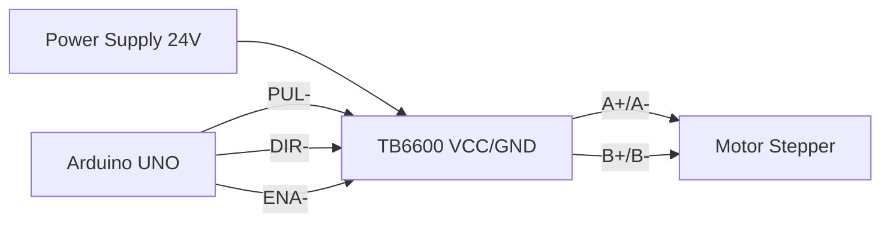

# **Dokumentasi Lengkap Driver Motor TB6600HG**

## **Daftar Isi**
1. **Pendahuluan**  
2. **Spesifikasi Teknis**  
3. **Diagram Pin dan Fungsi**  
4. **Prinsip Kerja Driver**  
5. **Konfigurasi Microstepping**  
6. **Pengaturan Arus Output**  
7. **Sistem Proteksi**  
8. **Panduan Pengkabelan**  
9. **Contoh Implementasi dengan Arduino**  
10. **Troubleshooting**  
11. **Aplikasi Praktis**  
12. **FAQ**  

---

## 1. Pendahuluan
**TB6600HG** adalah driver motor stepper berbasis chip TB6600 buatan Toshiba yang dirancang untuk mengendalikan motor stepper bipolar 2-fase. Driver ini mampu menyediakan arus hingga 4.5A dan tegangan operasi 9-42V DC, dengan dukungan fitur microstepping hingga 1/32. Cocok untuk aplikasi CNC, robotika, printer 3D, dan sistem otomasi industri.

---

## 2. Spesifikasi Teknis
| Parameter | Nilai |
|-----------|-------|
| Tegangan Input | 9V - 42V DC |
| Arus Output | 1.0A - 4.5A (dapat diatur) |
| Tegangan Logika | 3.3V - 5V |
| Resolusi Step | 1, 1/2, 1/4, 1/8, 1/16, 1/32 |
| Efisiensi | >90% |
| Proteksi | Overheat, Over-current, Under-voltage |
| Suhu Operasi | -10°C hingga 70°C |
| Ukuran PCB | 58mm x 45mm x 33mm |

---

## 3. Diagram Pin dan Fungsi
### **Terminal Daya & Motor**
| Pin | Fungsi |
|-----|--------|
| VCC | Input tegangan positif (9-42V DC) |
| GND | Ground daya |
| A+  | Output kumparan A+ motor |
| A-  | Output kumparan A- motor |
| B+  | Output kumparan B+ motor |
| B-  | Output kumparan B- motor |

### **Terminal Kontrol Logika**
| Pin | Fungsi | Catatan |
|-----|--------|---------|
| PUL+ | Input pulsa positif | Terhubung ke VCC logika |
| PUL- | Input pulsa negatif | Terhubung ke sinyal microcontroller |
| DIR+ | Input arah positif | Terhubung ke VCC logika |
| DIR- | Input arah negatif | Terhubung ke sinyal microcontroller |
| ENA+ | Input enable positif | Terhubung ke VCC logika |
| ENA- | Input enable negatif | Terhubung ke sinyal microcontroller |

### **DIP Switch Microstepping**
| SW1 | SW2 | SW3 | Resolusi |
|-----|-----|-----|----------|
| ON  | ON  | ON  | Full Step (1) |
| OFF | ON  | ON  | 1/2 Step |
| ON  | OFF | ON  | 1/4 Step |
| OFF | OFF | ON  | 1/8 Step |
| ON  | ON  | OFF | 1/16 Step |
| OFF | ON  | OFF | 1/32 Step |

---

## 4. Prinsip Kerja Driver
Driver bekerja dengan mengonversi sinyal digital menjadi arus presisi ke motor stepper:
- **Sistem PWM**: Mengatur arus ke kumparan motor menggunakan modulasi lebar pulsa
- **Sinyal Kontrol**:
  - **PUL**: Setiap transisi LOW→HIGH menghasilkan satu microstep
  - **DIR**: HIGH = CW, LOW = CCW
  - **ENA**: HIGH = nonaktifkan driver, LOW = aktifkan
- **Proteksi Aktif**: Mematikan output saat deteksi:
  - Suhu > 150°C
  - Arus melebihi threshold
  - Tegangan input < 8V

---

## 5. Konfigurasi Microstepping (Detail)
### **Konsep Dasar**
Microstepping membagi satu langkah penuh (1.8° pada motor standar) menjadi langkah-langkah kecil untuk:
- Mengurangi resonansi mekanik
- Meningkatkan akurasi posisi
- Menghasilkan gerakan lebih halus

### **Perbandingan Resolusi**
| Resolusi | Step/Rev (Motor 200 step) | Akurasi | Kehalusan |
|----------|----------------------------|---------|-----------|
| 1/1     | 200 | ±0.09° | Rendah |
| 1/8     | 1600 | ±0.011° | Sedang |
| 1/32    | 6400 | ±0.0028° | Sangat Halus |

### **Karakteristik Elektrik**
- **Arus Sinusoidal**: Driver menghasilkan profil arus sinusoidal untuk tiap kumparan
- **Phase Current**:
  ```
  I_A = I_max * sin(θ)
  I_B = I_max * cos(θ)
  ```
  Dimana θ bertambah sesuai microstep

---

## 6. Pengaturan Arus Output
### **Prosedur Kalibrasi**
1. Ukur tegangan pada titik **Vref** (biasanya dekat potensiometer)
2. Hitung arus output dengan rumus:
   ```
   I_out = (V_ref × 0.8) / 0.5
   ```
   Contoh: V_ref = 1.25V → I_out = (1.25 × 0.8) / 0.5 = 2.0A
3. Atur potensiometer hingga Vref sesuai kebutuhan

### **Tabel Referensi Arus**
| Arus Motor | Vref (V) | 
|------------|----------|
| 1.5A | 0.94 | 
| 2.0A | 1.25 | 
| 3.0A | 1.88 | 
| 4.0A | 2.50 | 

> ⚠️ **Peringatan**: Jangan melebihi 80% rating arus motor untuk pencegahan overheating

---

## 7. Sistem Proteksi
| Proteksi | Mekanisme | Indikator |
|----------|-----------|-----------|
| **Over-Current (OC)** | Matikan MOSFET saat arus > 5.5A | LED merah |
| **Over-Temperature (OT)** | Nonaktifkan driver saat suhu > 150°C | LED merah |
| **Under-Voltage (UV)** | Lockout saat Vin < 8V | LED merah |
| **Short-Circuit** | Deteksi arus instan | Auto-shutdown |

Reset proteksi dengan memutuskan dan menyambung kembali daya.

---

## 8. Panduan Pengkabelan


### **Langkah Kritis:**
1. Gunakan kabel terpisah untuk daya dan sinyal
2. Ground Arduino dan TB6600 harus terhubung
3. Untuk motor 4-kabel:
   - Ukur resistansi kumparan dengan multimeter
   - Pasang A+/A- dan B+/B- sesuai pasangan kumparan

---

## 9. Contoh Implementasi dengan Arduino
### **Library Recomended:**
```cpp
#include <AccelStepper.h>
#define PUL_PIN 2
#define DIR_PIN 3
#define ENA_PIN 4

AccelStepper stepper(AccelStepper::DRIVER, PUL_PIN, DIR_PIN);

void setup() {
  pinMode(ENA_PIN, OUTPUT);
  digitalWrite(ENA_PIN, LOW); // Enable driver
  
  stepper.setMaxSpeed(1000);    // Steps/s
  stepper.setAcceleration(500); // Steps/s²
  stepper.moveTo(6400);         // 1 rev @ 1/32 microstepping
}

void loop() {
  if (stepper.distanceToGo() == 0) {
    stepper.moveTo(-stepper.currentPosition());
  }
  stepper.run();
}
```

### **Parameter Penting:**
- **Kecepatan Maks**: 200,000 steps/detik (teoritis)
- **Pulse Width Minimum**: 2.5μs
- **Rekomendasi Delay**: >5μs antara pulsa

---

## 10. Troubleshooting
| Masalah | Penyebab | Solusi |
|---------|----------|--------|
| Motor panas | Arus terlalu tinggi | Turunkan Vref |
| Langkah terlewat | Frekuensi pulsa terlalu tinggi | Kurangi kecepatan |
| Motor bergetar | Resonansi mekanik | Aktifkan microstepping |
| Driver tidak responsif | ENA aktif tinggi | Set ENA ke LOW |
| LED merah menyala | Proteksi aktif | Reset daya |

---

## 11. Aplikasi Praktis
1. **CNC Router**: 
   - Konfigurasi: 1/16 microstepping
   - Kecepatan: 800 steps/detik
2. **Robotik Arm**:
   - Torsi tinggi dengan 4.2A output
   - Closed-loop dengan encoder eksternal
3. **Conveyor System**:
   - Multi-driver sinkronisasi via PLC

---

## 12. FAQ
**Q: Apa beda TB6600 dengan A4988?**  
A: TB6600 mendukung arus lebih tinggi (4.5A vs 2A) dan memiliki proteksi lebih lengkap.

**Q: Bisakah mengontrol dua motor dengan satu driver?**  
A: Tidak, satu driver hanya untuk satu motor stepper bipolar.

**Q: Mengapa motor berdengung tapi tidak berputar?**  
A: Kemungkinan fase motor terbalik, periksa koneksi kumparan.

**Q: Berapa efisiensi driver ini?**  
A: >90% pada beban penuh dengan heatsink memadai.

**Q: Dapatkah bekerja dengan Raspberry Pi?**  
A: Ya, gunakan level shifter 3.3V ke 5V untuk sinyal kontrol.

---

**© Dokumentasi TB6600HG v1.2**  
*Referensi: Datasheet Toshiba TB6600HG, Pengujian Empiris, CNC Design Handbook*